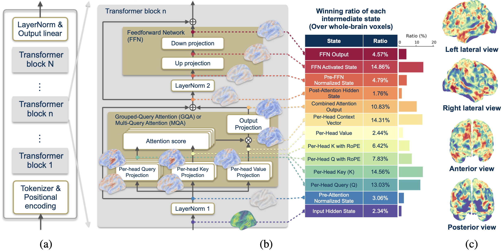

# The Mind's Transformer: Computational Neuroanatomy of LLM-Brain Alignment

## 📝 Overview

**MindTransformer** systematically dissects 13 intermediate computational states within transformer blocks to achieve superior brain alignment. Our framework achieves a **31% improvement** in the primary auditory cortex, surpassing the gains typically achieved by 456× model scaling.



---

## 📂 Project Structure

```text
.
├── config_lpp.yaml             # Main configuration template
├── config_lpp_*.yaml           # Model-specific configs (Llama, Mistral, etc.)
├── mindtransformer.py          # Core encoding framework (Modes 1 & 2)
├── requirements.txt            # Dependencies
├── script/                     # HPC Automation Scripts
│   ├── setup.sbatch            # Environment setup
│   ├── download.sbatch         # Data download
│   ├── preprocess.sbatch       # Preprocessing pipeline
│   ├── all_mindtransformer.bash # Main Experiment Controller
│   └── job_mindtransformer.sbatch
└── data/                       # Data storage
````

-----

## 🛠️ Installation

### Option A: Automated Setup (Recommended for HPC/Slurm)

If you're on a Slurm-based HPC cluster, use our automated scripts for a streamlined setup:

```bash
# 1. Clone the repository
git clone https://github.com/your-username/MindTransformer.git
cd MindTransformer

# 2. Navigate to the script directory
cd script

# 3. Create logs directory (required for Slurm output)
mkdir -p logs

# 4. Run the environment setup script
sbatch setup.sbatch
```

This script will:
- Create a conda environment (`mindtransformer_env`) with Python 3.10
- Install all dependencies from `requirements.txt`
- Upgrade `transformers` to the latest version

> **Note:** Before running, edit `script/setup.sbatch` to configure cluster-specific settings:
> - Uncomment and set `#SBATCH --account=` and `#SBATCH -q` if required by your cluster
> - Adjust `module load` commands to match your cluster's naming conventions

### Option B: Manual Setup (Local/Non-Slurm)

For local machines or non-Slurm environments:

```bash
# 1. Clone the repository
git clone https://github.com/your-username/MindTransformer.git
cd MindTransformer

# 2. Create and activate conda environment
conda create -y --name mindtransformer_env python=3.10
conda activate mindtransformer_env

# 3. Install dependencies
pip install -r requirements.txt
pip install --upgrade transformers
```

---

## 📊 Data Setup

### Option A: Automated Download (Recommended for HPC/Slurm)

After the environment setup job completes, download the data:

```bash
# From the script/ directory
cd script  # if not already there
sbatch download.sbatch
```

This script will automatically:
1. Download spaCy language models (English, French, Chinese)
2. Download the full OpenNeuro fMRI dataset (ds003643) via AWS S3
3. Download and extract GloVe embeddings

> **Note:** The download may take several hours depending on network speed. The OpenNeuro dataset is more than 200GB.

### Option B: Manual Download (Local/Non-Slurm)

#### 1. spaCy Language Models

```bash
conda activate mindtransformer_env
pip install https://github.com/explosion/spacy-models/releases/download/en_core_web_sm-3.7.1/en_core_web_sm-3.7.1-py3-none-any.whl
pip install https://github.com/explosion/spacy-models/releases/download/fr_core_news_sm-3.7.0/fr_core_news_sm-3.7.0-py3-none-any.whl
pip install https://github.com/explosion/spacy-models/releases/download/zh_core_web_sm-3.7.0/zh_core_web_sm-3.7.0-py3-none-any.whl
```

#### 2. fMRI Dataset

We use the **"Le Petit Prince multilingual naturalistic fMRI corpus"** by Li et al. (2022).

- **Citation:** Li, J., Bhattasali, S., Zhang, S., Franzluebbers, B., Luh, W., Spreng, R. N., Brennan, J., Yang, Y., Pallier, C., & Hale, J. (2022). Le Petit Prince multilingual naturalistic fMRI corpus. *Scientific Data*, 9, 530.
- **Data access:** [doi:10.18112/openneuro.ds003643.v2.0.5](https://doi.org/10.18112/openneuro.ds003643.v2.0.5)

```bash
# Requires AWS CLI (install via: pip install awscli)
aws s3 sync --no-sign-request s3://openneuro.org/ds003643 data/ds003643/
```

> *Note: For reproducing our main results (in English), the script specifically targets the `annotation/EN` and `derivatives/sub-EN*` subfolders.*
> *Note: We strongly recommend going through [llms_brain_lateralization](https://github.com/l-bg/llms_brain_lateralization) for the dataset preparation and preprocessing since this repository is where we adopt the code for the data pipeline.*

#### 3. Word Embeddings (GloVe)

We use GloVe embeddings as a static baseline:

```bash
mkdir -p data/glove
cd data/glove
wget https://huggingface.co/stanfordnlp/glove/resolve/main/glove.6B.zip
unzip glove.6B.zip
rm glove.6B.zip  # Optional: remove zip to save space
cd ../..
```

This will extract `glove.6B.300d.txt`, which is used in our experiments.

### Quick Start Summary

| Step | Slurm (HPC) | Local |
|------|-------------|-------|
| 1. Environment | `cd script && sbatch setup.sbatch` | Manual conda + pip |
| 2. Data | `sbatch download.sbatch` | Manual spacy + wget + aws |
| 3. Preprocess | `sbatch preprocess.sbatch` | Run Python scripts directly |
| 4. Experiments | `./all_mindtransformer.bash` | `python mindtransformer.py ...` |

> **Important:** All `sbatch` commands should be executed from the `script/` directory.

## 🔧 Configuration

All project settings are managed through centralized YAML configuration files (e.g., `config_lpp.yaml`). This structured approach makes it easy to modify parameters and adapt the project to different experiments.

### Core Configuration Settings

Before running any scripts, you must update the authentication and path settings.

**1. Authentication:**
For accessing gated LLMs (like Llama-3) on Hugging Face:

```yaml
auth:
  huggingface_token: "YOUR_HF_TOKEN_HERE" 
```

**2. Paths:**
The configuration uses relative paths by default, but you can customize them if your data resides elsewhere:

```yaml
paths:
  home_folder: "." 
  data_root: "./data/ds003643"
  glove_path: "./data/glove/glove.6B.300d.txt"
```

**3. Language and Models:**
You can toggle specific models on or off using the `enabled` flag:

```yaml
experiment:
  language: "en"  # Options: en, fr, cn

models:
  - name: "meta-llama/Llama-3.2-1B-Instruct"
    enabled: true
    type: "llama"
```

### Running with the Configuration

All scripts in the project accept the config file as an argument:

```bash
python script_name.py --config config_lpp.yaml
```

-----

## 🔄 Scientific Pipeline

This section details the step-by-step Python commands to reproduce our computational neuroanatomy analysis.

### Step 1: fMRI Preprocessing

We standardize the fMRI data to 4x4x4mm voxels, compute intersection masks, and generate group-level signals.

```bash
# 1. Resample fMRI data to standard voxel size
python resample_fmri_data.py --config config_lpp.yaml

# 2. Compute common brain mask across subjects
python compute_mask.py --config config_lpp.yaml

# 3. Compute Average Subject (for noise ceiling & group analysis)
python compute_average_subject_fmri.py --config config_lpp.yaml

# 4. Prepare Per-Subject data (for individual validation)
python compute_per_subject_fmri.py --config config_lpp.yaml
```

### Step 2: Extract LLM Intermediate States

We decompose each transformer block into 13 distinct states. Extraction is typically run per model family to manage memory resources.

```bash
# Extract Llama (Example)
python extract_llm_activations.py --config config_lpp_llama.yaml

# Extract Mistral
python extract_llm_activations.py --config config_lpp_mistral.yaml
```

### Step 3: MindTransformer Analysis

We propose two modes to align these extracted states with brain activity. The core script is `mindtransformer.py`.

#### A. Baselines

We benchmark against static embeddings (GloVe) and random networks.

```bash
# 1. Extract baseline features
python extract_glove_activations.py --config config_lpp.yaml
python generate_random_activations.py --config config_lpp.yaml

# 2. Run encoding
python mindtransformer.py --config config_lpp.yaml --run "glove"
python mindtransformer.py --config config_lpp.yaml --run "random"
```

#### B. Mode 1: Optimal Single-State Selection

Systematically evaluates all 13 states to identify the single best predictor for each voxel. This reveals the **intra-block hierarchy**.

```bash
# Example: Fit the 'per_head_q_rope' state
python mindtransformer.py \
    --config config_lpp_llama.yaml \
    --subject average \
    --run llm-mode1 \
    --layers 1 \
    --inputs per_head_q_rope
```

#### C. Mode 2: Multi-State Feature Integration

Learns a combined representation from multiple states using a two-stage feature selection process (using a "Pivot" layer). This yields **SOTA alignment**.

```bash
# Example: Combine attention and FFN states, using input_hidden_state as pivot
python mindtransformer.py \
    --config config_lpp_llama.yaml \
    --subject "average" \
    --run "llm-mode2" \
    --layers 1 \
    --inputs per_head_q per_head_q_rope per_head_k per_head_k_rope attn_output ffn_activated_state \
    --pivot_input "input_hidden_state" \
    --parcel "Heschl's Gyrus"
```

-----

## ⚡ HPC Automation (Slurm)

To facilitate large-scale analysis (e.g., sweeping all layers of a 70B model), we provide an automated orchestration suite in the `script/` directory.

**1. Setup & Preprocessing**

```bash
sbatch script/setup.sbatch       # Builds env
sbatch script/download.sbatch    # Downloads data
sbatch script/preprocess.sbatch  # Runs ALL Step 1 & Step 2 commands
```

**2. Experiment Runner**
The `all_mindtransformer.bash` script is the master controller. It automatically submits separate jobs for every layer and configuration to your cluster.

**Important:** You must run this script from inside the `script/` directory.

```bash
cd script/

# Configure the run mode inside the script:
# RUN="llm-mode1" (or "llm-mode2")
# SUBJECT="average"
nano all_mindtransformer.bash

# Launch the full experiment suite
./all_mindtransformer.bash
```

-----

## 🎛️ Detailed Experiment Configuration

The master script `script/all_mindtransformer.bash` controls the entire experimental suite. This section explains how to configure it for Baselines, Mode 1, Mode 2, and Subject selection.

### 1\. Subject Selection (`SUBJECT`)

You can run analysis on the group average (standard for noise ceiling) or individual subjects.

```bash
# Option A: Group Average (Recommended for main results)
SUBJECT="average"

# Option B: Specific Subject(s) by ID (Space-separated)
# SUBJECT="057 058 059"

# Option C: All Subjects (Iterates through everyone in the dataset)
# SUBJECT="all"
```

### 2\. Baselines (`glove` or `random`)

Baselines do not require model-specific configurations or layer loops.

```bash
RUN="glove"  # or "random"

# For baselines, always use the generic config
CONFIGS=(
    "config_lpp.yaml"
)

# Dummy values (ignored by baseline script but required for variables)
MIN_LAYER=1
MAX_LAYER=1
LLM_INPUTS=("none")
```

### 3\. LLM Mode 1: Independent Feature Regression

In this mode, we submit **one job per feature, per layer**. The script iterates through the `LLM_INPUTS` array.

**Configuration:**

```bash
RUN="llm-mode1"

# Select your model configuration
CONFIGS=(
    "config_lpp_llama.yaml"
)

# Set Layer Range (See Reference Table below)
MIN_LAYER=1
MAX_LAYER=80  # Example for Llama-3.3-70B

# Define features to analyze (Array format)
LLM_INPUTS=(
    'input_hidden_state'
    'pre_attn_norm'
    'per_head_q'
    'per_head_q_rope'
    'per_head_k'
    'per_head_k_rope'
    'per_head_v'
    'per_head_context_vector'
    'attn_output'
    'post_attn_hidden_state'
    'pre_ffn_norm'
    'ffn_activated_state'
    'ffn_output'
)
```

### 4\. LLM Mode 2: Multi-State Pivot Regression

In this mode, we submit **one job per layer** that processes **all features** together. The script requires the features to be passed as a single concatenated string.

**Configuration:**

```bash
RUN="llm-mode2"

# Select your model configuration
CONFIGS=(
    "config_lpp_llama.yaml"
)

# Set Layer Range
MIN_LAYER=1
MAX_LAYER=80

# Define features to COMBINE (Single string in array)
LLM_INPUTS=(
    "per_head_q per_head_q_rope per_head_k per_head_k_rope attn_output ffn_activated_state"
)

# Define the Pivot for feature selection
PIVOT_INPUT="input_hidden_state"
```

### 📚 Layer Reference Table (`MAX_LAYER`)

When setting `MAX_LAYER`, refer to the specific architecture of the model defined in your yaml file:

| Config File | Model Family | Max Layer |
| :--- | :--- | :--- |
| `config_lpp_llama.yaml` | Llama-3 (70B) | **80** |
| `config_lpp_mistral.yaml` | Mistral Large | **88** |
| `config_lpp_qwen.yaml` | Qwen-3 (32B) | **64** |
| `config_lpp_gemma.yaml` | Gemma-3 (27B) | **62** |
| `config_lpp_gptoss.yaml` | GPT-OSS | **36** |


### 🧠 Brain Region Configuration for LLM Mode 2 (Parcels)

In Mode 2, you can restrict the analysis to specific anatomical regions (parcels) defined by the **Harvard-Oxford Structural Atlas**. This is configured directly inside `script/job_mindtransformer.sbatch`.

**1. Whole Brain Analysis**
To run the analysis on all voxels in the brain mask, set the array to "all":

```bash
PARCELS=("all")
```

**2. Specific Regions (Auditory & Language)**
Our default configuration targets 10 key regions involved in auditory and language processing:

```bash
PARCELS=(
    "Heschl's Gyrus (includes H1 and H2)"
    "Planum Temporale"
    "Superior Temporal Gyrus, posterior division"
    "Superior Temporal Gyrus, anterior division"
    "Middle Temporal Gyrus, temporooccipital part"
    "Middle Temporal Gyrus, posterior division"
    "Middle Temporal Gyrus, anterior division"
    "Inferior Frontal Gyrus, pars opercularis"
    "Inferior Frontal Gyrus, pars triangularis"
    "Angular Gyrus"
)
```

**3. Full Atlas Reference**
The framework supports any of the 48 cortical regions defined in the Harvard-Oxford Cortical Structural Atlas. To view the complete list of available parcel names, you can run the following Python snippet:

```python
from nilearn import datasets

# Fetch the atlas
dataset = datasets.fetch_atlas_harvard_oxford('cort-maxprob-thr25-1mm')

# Print all 48 available labels (skipping background)
print("Available Parcels:")
for label in dataset.labels[1:]:
    print(f"- \"{label}\"")
```

-----

## 🧠 Intermediate States Analyzed

We extract 13 states per block, categorized into three computational stages.

| Stage | State Key | Description |
| :--- | :--- | :--- |
| **Block Input** | `input_hidden_state` | Standard baseline input |
| | `pre_attn_norm` | Layer-normalized input |
| **Attention** | `per_head_q` / `_k` / `_v` | Query/Key/Value projections |
| | `per_head_q_rope` | Query with **Rotary Positional Embeddings** (Critical for auditory alignment) |
| | `per_head_k_rope` | Key with Rotary Positional Embeddings |
| | `per_head_context_vector` | Attention output per head |
| | `attn_output` | Multi-head attention output (projection) |
| **FFN & Residuals** | `post_attn_hidden_state` | Residual stream after Attention |
| | `pre_ffn_norm` | Before FFN layer norm |
| | `ffn_activated_state` | FFN intermediate activation (e.g., SwiGLU) |
| | `ffn_output` | Final FFN block output |

-----

## 📈 Key Results

Our computational neuroanatomy analysis reveals:

  * **Auditory Alignment:** MindTransformer Mode 2 achieves a correlation of **0.467** in Heschl's Gyrus, a **31.0% improvement** over standard baselines.
  * **RoPE Importance:** Per-Head Query with RoPE explains **73.88%** of voxels in the auditory cortex, compared to just 7.82% without RoPE.
  * **Intra-Block Hierarchy:** Early attention states map to sensory regions (HG, PT), while later FFN states map to association regions (IFG, AG).

-----

### 🏗️ Supported Models & Architectures

We analyze 21 state-of-the-art LLMs across five model families. The architectural parameters for each model are detailed below.

| Family | Model Variant (Model size) | $D_{\text{model}}$ | $N_q$ | $N_{kv}$ | $D_{\text{head}}$ | $D_{\text{ffn}}$ | $N_{\text{layer}}$ |
| :--- | :--- | :--- | :--- | :--- | :--- | :--- | :--- |
| **Llama** | Llama 3.2 Instruct (1B) | 2048 | 32 | 8* | 64 | 8192 | 16 |
| | Llama 3.2 Instruct (3B) | 3072 | 24 | 8* | 128 | 8192 | 28 |
| | Llama 3.1 Instruct (8B) | 4096 | 32 | 8* | 128 | 14336 | 32 |
| | Llama 3.3 Instruct (70B) | 8192 | 64 | 8* | 128 | 28672 | 80 |
| **Qwen** | Qwen3 (0.6B) | 1024 | 16 | 8* | 128 | 3072 | 28 |
| | Qwen3 (1.7B) | 2048 | 16 | 8* | 128 | 6144 | 28 |
| | Qwen3 (4B) | 2560 | 32 | 8* | 128 | 9728 | 36 |
| | Qwen3 (8B) | 4096 | 32 | 8* | 128 | 12288 | 36 |
| | Qwen3 (14B) | 5120 | 40 | 8* | 128 | 17408 | 40 |
| | Qwen3 (32B) | 5120 | 64 | 8* | 128 | 25600 | 64 |
| **Mistral** | Mistral 7B Instruct v0.2 (7B) | 4096 | 32 | 8* | 128 | 14336 | 32 |
| | Mistral 7B Instruct v0.3 (7B) | 4096 | 32 | 8* | 128 | 14336 | 32 |
| | Mistral Small Instruct (22B) | 6144 | 48 | 8* | 128 | 16384 | 56 |
| | Mistral Large Instruct (123B) | 12288 | 96 | 8* | 128 | 28672 | 88 |
| **GPT** | GPT-oss (20B) | 2880 | 64 | 8* | 64 | 2880† | 24 |
| | GPT-oss (120B) | 2880 | 64 | 8* | 64 | 2880† | 36 |
| **Gemma** | Gemma 3 Instruct (270M) | 640 | 4 | 1* | 256 | 2048 | 18 |
| | Gemma 3 Instruct (1B) | 1152 | 4 | 1* | 256 | 6912 | 26 |
| | Gemma 3 Instruct (4B) | 2560 | 8 | 4* | 256 | 10240 | 34 |
| | Gemma 3 Instruct (12B) | 3840 | 16 | 8* | 256 | 15360 | 48 |
| | Gemma 3 Instruct (27B) | 5376 | 32 | 16* | 128 | 21504 | 62 |

*\* Model uses Grouped-Query Attention (GQA) or Multi-Query Attention (MQA), where $N_{kv} < N_q$.*

*† Value is per expert in a Mixture-of-Experts (MoE) model.*

-----

## 🙏 Acknowledgement

Kudos to the github repository [llms_brain_lateralization](https://github.com/l-bg/llms_brain_lateralization) and their [NeurIPS paper](https://neurips.cc/virtual/2024/poster/94784).


-----

## 📚 Citation

```bibtex
@inproceedings{mindtransformer2026,
  title={The Mind's Transformer: Computational Neuroanatomy of LLM-Brain Alignment},
  author={Cheng-Yeh Chen and Raghupathy Sivakumar},
  booktitle={International Conference on Learning Representations (ICLR)},
  year={2026}
}
```
